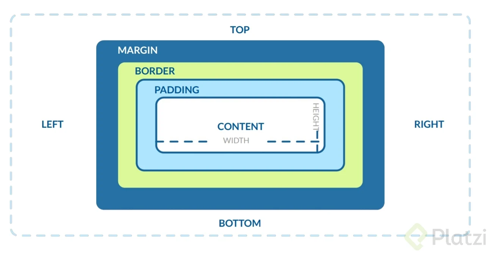

# Modelo de Caja en CSS

El modelo de caja es un concepto fundamental en CSS que describe cómo se estructuran y organizan los elementos HTML en una página web. Cada elemento en CSS se representa como una caja rectangular, la cual está compuesta por varias partes:

1.  **Contenido**: El área donde se muestra el contenido del elemento, como texto o imágenes.

2.  **Padding (relleno)**: El espacio entre el contenido y el borde del elemento. El padding empuja el borde hacia afuera, aumentando el tamaño total de la caja.

3.  **Border (borde)**: Un contorno alrededor del padding y del contenido. El borde se puede estilizar con diferentes colores, grosores y estilos (sólido, punteado, etc.).

4.  **Margin (margen)**: El espacio fuera del borde, separando el elemento de otros elementos. El margen no tiene color y es completamente transparente.

## Diagrama del Modelo de Caja



## Propiedades del Modelo de Caja

### Content (contenido)

No tiene propiedades CSS específicas, es el área donde se muestra el contenido.

### Padding (relleno)

- padding-top
- padding-right
- padding-bottom
- padding-left
- padding (shorthand para definir los cuatro lados a la vez o de manera individual)

### Border (borde)

- border-width
- border-style
- border-color
- border (shorthand para definir los tres valores anteriores a la vez)
- border-top
- border-right
- border-bottom
- border-left

### Margin (margen)

- margin-top
- margin-right
- margin-bottom
- margin-left
- margin (shorthand para definir los cuatro lados a la vez o de manera individual)

Por ejemplo:

```css
div {
  width: 300px; /* Ancho del contenido */
  padding: 20px; /* Relleno alrededor del contenido */
  border: 5px solid black; /* Borde alrededor del relleno */
  margin: 10px; /* Margen fuera del borde */
}
```
