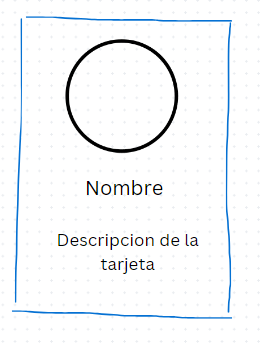
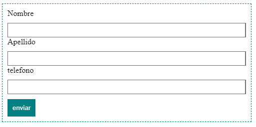

# Ejercicios de HTML y CSS

## Creación de una Página Básica:

**Objetivo**: Crear una estructura básica de HTML y aplicar algunos estilos básicos con CSS.

Crea un archivo HTML con la siguiente estructura:

- Un encabezado (`<h1>`) con el texto "Mi Primera Página Web".
- Un párrafo (`<p>`) con algún texto de tu elección.
- Una lista ordenada (`<ol>`) con tres elementos (`<li>`).
- Crea un archivo CSS y enlázalo con tu archivo HTML.

Aplica los siguientes estilos usando CSS:

- Cambia el color del texto del encabezado a azul.
- Cambia la fuente del párrafo a Arial.
- Aplica un margen de 20px a la lista ordenada.

## Estilizar una Tarjeta de Perfil

**Objetivo**: Crear una tarjeta de perfil con HTML y CSS.

Crea una estructura HTML para una tarjeta de perfil que incluya:

- Un contenedor que tendrá los elementos de la tarjeta
- Una imagen (``) de perfil. (puedes usar una imagen de internet o guardar una imagen propia en una carpeta `imgs` en el proyecto)

- Un encabezado (`<h2>`) con el nombre de la persona.
- Un párrafo (`<p>`) con una breve descripción.

Usa CSS para estilizar la tarjeta:

- Asegúrate de que la imagen sea redonda y tenga un tamaño de 150px por 150px.
- Centra el texto en la tarjeta.
- Aplica un borde de 1px sólido y un padding de 10px alrededor de la tarjeta.

Puedes basarte en este dibujo:



## Diseño de un Formulario de Contacto

**Objetivo**: Crear y estilizar un formulario de contacto.

Crea un formulario HTML que incluya:

- Un elemento que contenga los elementos
- Un campo de texto para el nombre.
- Un campo de texto para el correo electrónico.
- Un campo de texto para el numero de contacto.
- Un botón de envío.

Usa CSS para estilizar el formulario:

- Dale un tamaño al contenedor de 400px
- Asegúrate de que los campos de texto tengan un ancho del 100%.
- Aplica un padding de 5px a los campos de texto.
- Cambia el color de fondo del botón de envío a verde y el color del texto del botón a blanco.
- Quita el borde del botón.
- Dale un padding al botón de 10px.
- Aplica un margen de 10px entre cada campo de texto del formulario.
- Aplica un borde de tu elección al contenedor
- Aplica un padding de 10px al contenedor

Debes incluir este estilo en tu hoja de estilos css

```css
* {
  box-sizing: border-box;
}
```

Puedes basarte en este ejemplo:



## Creación de un Menú de Navegación

**Objetivo**: Crear un menú de navegación horizontal y estilizarlo con CSS.

Crea una estructura HTML para un menú de navegación que incluya:

- Una lista no ordenada con cinco elementos de lista que contengan enlaces a diferentes secciones de la página.

Usa CSS para estilizar el menú de navegación:

- Elimina los estilos predeterminados de la lista.
- Muestra los elementos de la lista en una sola fila.
- Aplica un fondo oscuro al menú y cambia el color del texto de los enlaces a blanco.
- Asegúrate de que los enlaces cambien de color cuando el cursor pase sobre ellos (`:hover`)

Este ejercicio queda a tu imaginación.

> TO BE CONTINUE
